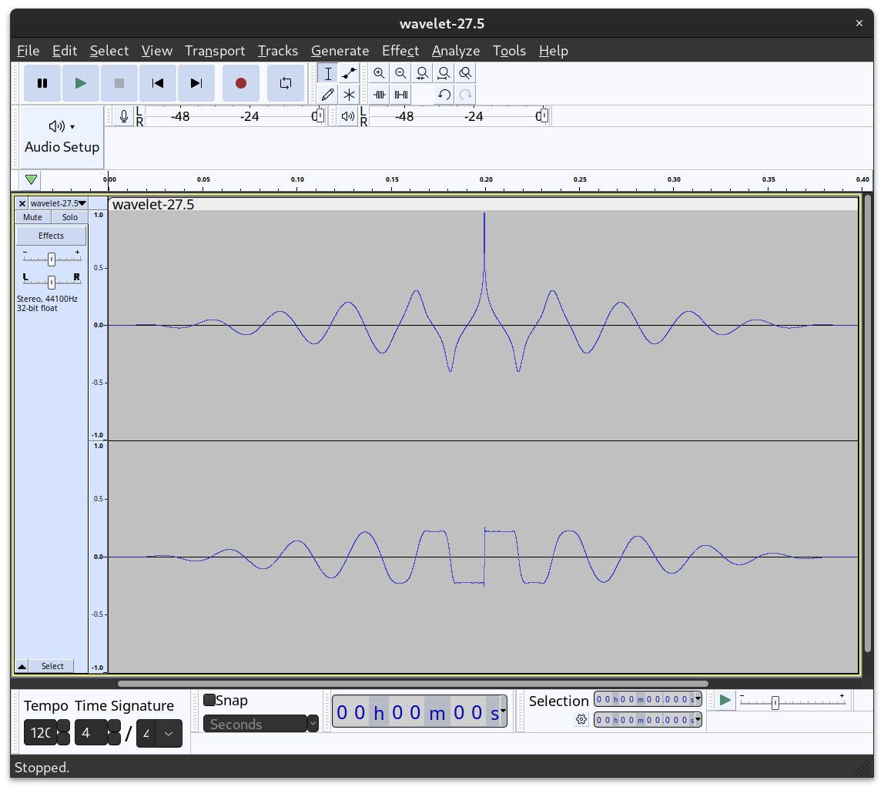

# Music Notes Detection Algorithm using Wavelets

## Purpose

The main purpose of this script is to visually analyze the frequency content of an audio file. By converting audio signals into a video synchronized with the audio recording, it allows for a more intuitive understanding of the framework of a song - especially for non-musical people like me ;-).

- See the [example video](https://youtu.be/MNQDnYMVxkg) ("The Great Giana Sisters" by Chris Huelsbeck)

In essence, this script bridges the gap between audio and visual representations, making it easier to interpret and analyze musical notes in recorded songs.

This script converts a `spectrum.wav` audio recording into a horizontal waterfall image `spectrum.tiff` with all harmonics removed for easier visual understanding by humans. By using FFMPEG the image can be converted into an scrolling waterfall animation. Please check the FFMPEG example at the end for for generating that animation.

Each line in the output corresponds to a note - the output is 96 pixels high, corresponding to eigth octaves starting at 27.56Hz. The video is stretched by 5, brtinging the vertical resolution to 480px.

For each line a custom wavelet is generated, covering all odd harminics up to a 5th of the sampling frequency. Below you can see the wavelet for 27.5Hz:



## Walkthrough of Functionality

### Imports
The script uses several libraries:
- `PIL` for image processing
- `numpy` for numerical operations
- `scipy.signal` and `scipy.io.wavfile` for signal processing
- `matplotlib.pyplot` for colormap generation

### Constants
- `ColsPerSecond`: Defines the number of columns per second in the output image. This number determines the scrolling speed when converting the waterfall image into a scrolling waterfall animation.

### Functions
1. **`wavelet(Fs, Fw, N=11)`**: 
   - Generates a complex wavelet for a given sampling frequency (`Fs`), wavelet frequency (`Fw`), and duration (`N`).

2. **`wavelet_harmonics(Fs, Fw, Fmax=0, N=11, harmonics_step=2)`**:
   - Creates a composite wavelet per note, including harmonics up to a specified maximum frequency (`Fmax`).

3. **`wavelet_notes(octaves=8)`**:
   - Generates an array of musical note frequencies over a given number of octaves.

4. **`wavelet_palette(colormap, num_colors)`**:
   - Generates a pleasant colormap palette using `matplotlib`.

5. **`wavelet_image(image, colormap='terrain', num_colors=4096)`**:
   - Converts a processed image array to an `Image` object using a specified colormap.

### Main Processing
1. Reads the WAV file (`spectrum.wav`) and converts it to a normalized complex signal.
2. Calculates convolutions for each musical note frequency, generating an image array.
3. Downsamples the image to match the defined columns per second.
4. Converts the image array to an image object and saves it as `spectrum.tiff`.

### FFmpeg Command
The script includes a commented command to convert the output image (`spectrum.tiff`) into a scrolling movie (`spectrum.mp4`) using FFmpeg:

```bash
ffmpeg -y -loop 1 -i spectrum.tiff -i spectrum.wav -vf "pad=iw+4096:ih:0:0,scale=iw:ih*5,crop=ih*16/9:ih:y=0:x=12*n" -r 25 -c:v libx264 -crf 25 -pix_fmt yuv420p -c:a aac -b:a 192k -shortest spectrum.mp4
